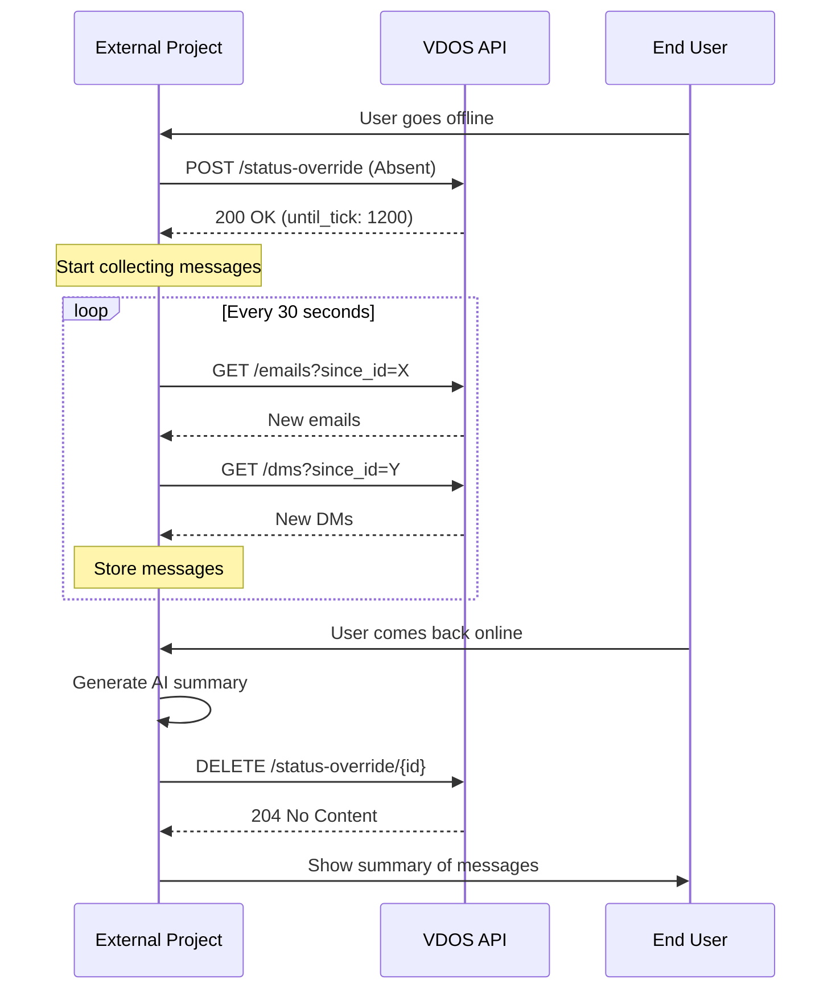

# External Integration Guide - VDOS Real-Time Integration

This guide explains how to integrate external projects with VDOS to:
1. Monitor real-time emails and chats for specific personas
2. Control persona availability (Absent/Offline status)
3. Collect messages while persona is offline and generate summaries

---

## Table of Contents

1. [Quick Start](#quick-start)
2. [API Endpoints](#api-endpoints)
3. [Integration Workflow](#integration-workflow)
4. [Code Examples](#code-examples)
5. [Simulation Monitor Dashboard](#simulation-monitor-dashboard)

---

## Quick Start

### Prerequisites

- VDOS services running:
  - Email Server: `http://127.0.0.1:8000`
  - Chat Server: `http://127.0.0.1:8001`
  - Simulation Manager: `http://127.0.0.1:8002`

### Default Ports (Configurable via Environment Variables)

```bash
VDOS_EMAIL_HOST=127.0.0.1
VDOS_EMAIL_PORT=8000
VDOS_CHAT_HOST=127.0.0.1
VDOS_CHAT_PORT=8001
VDOS_SIM_HOST=127.0.0.1
VDOS_SIM_PORT=8002
```

---

## API Endpoints

### 1. Get New Emails for a Persona

**Endpoint**: `GET /mailboxes/{address}/emails`

**Base URL**: `http://127.0.0.1:8000` (Email Server)

**Parameters**:
- `address` (path): Email address (e.g., `designer.1@blogsim.dev`)
- `since_id` (query, optional): Only return emails with ID > this value
- `since_timestamp` (query, optional): Only return emails after this ISO timestamp
- `limit` (query, optional): Maximum number of emails to return

**Example Request**:
```bash
# Get all new emails since ID 100
curl "http://127.0.0.1:8000/mailboxes/designer.1@blogsim.dev/emails?since_id=100"

# Get emails in the last hour
curl "http://127.0.0.1:8000/mailboxes/designer.1@blogsim.dev/emails?since_timestamp=2025-10-18T03:00:00"

# Get latest 10 emails
curl "http://127.0.0.1:8000/mailboxes/designer.1@blogsim.dev/emails?limit=10"
```

**Response**:
```json
[
  {
    "id": 101,
    "sender": "dev.1@blogsim.dev",
    "to": ["designer.1@blogsim.dev"],
    "cc": [],
    "bcc": [],
    "subject": "Update: 박민우 → 김유진",
    "body": "...",
    "thread_id": null,
    "sent_at": "2025-10-18T04:30:15.123456"
  }
]
```

---

### 2. Get New Chats/DMs for a Persona

**Endpoint**: `GET /users/{handle}/dms`

**Base URL**: `http://127.0.0.1:8001` (Chat Server)

**Parameters**:
- `handle` (path): Chat handle (e.g., `designer`)
- `since_id` (query, optional): Only return messages with ID > this value
- `since_timestamp` (query, optional): Only return messages after this ISO timestamp
- `limit` (query, optional): Maximum number of messages to return

**Example Request**:
```bash
# Get all new DMs since ID 50
curl "http://127.0.0.1:8001/users/designer/dms?since_id=50"

# Get DMs in the last hour
curl "http://127.0.0.1:8001/users/designer/dms?since_timestamp=2025-10-18T03:00:00"
```

**Response**:
```json
[
  {
    "id": 51,
    "room_slug": "dm:designer:dev",
    "sender": "dev",
    "body": "간단 업데이트: 디자인 시안 검토 부탁드립니다",
    "sent_at": "2025-10-18T04:32:10.456789"
  }
]
```

---

### 3. Get Messages in a Specific Room

**Endpoint**: `GET /rooms/{slug}/messages`

**Base URL**: `http://127.0.0.1:8001` (Chat Server)

**Parameters**:
- `slug` (path): Room slug (e.g., `team-general`, `dm:designer:dev`)
- `since_id`, `since_timestamp`, `limit`: Same as above

**Example Request**:
```bash
curl "http://127.0.0.1:8001/rooms/team-general/messages?since_id=100"
```

---

### 4. Set Persona to Absent/Offline

**Endpoint**: `POST /api/v1/people/status-override`

**Base URL**: `http://127.0.0.1:8002` (Simulation Manager)

**Request Body**:
```json
{
  "person_id": 1,
  "status": "Absent",
  "duration_ticks": 480,
  "reason": "External project triggered absence"
}
```

**Alternative (by name)**:
```json
{
  "person_name": "김유진",
  "status": "Offline",
  "reason": "User went offline"
}
```

**Fields**:
- `person_id` or `person_name`: Required (one of them)
- `status`: `"Absent"`, `"Offline"`, `"SickLeave"`, or `"OnLeave"`
- `duration_ticks`: Optional (defaults to end of current day)
- `reason`: Optional description

**Response**:
```json
{
  "person_id": 1,
  "person_name": "김유진",
  "status": "Absent",
  "until_tick": 480,
  "reason": "External project triggered absence",
  "message": "Status override set for 김유진 until tick 480"
}
```

**Tick Duration Reference**:
- Default: 480 ticks/day (1 tick = 1 minute)
- 1 hour = 60 ticks
- 1 day = 480 ticks
- 1 week = 2400 ticks (5 working days)

---

### 5. Clear Persona Status (Make Available)

**Endpoint**: `DELETE /api/v1/people/{person_id}/status-override`

**Base URL**: `http://127.0.0.1:8002` (Simulation Manager)

**Example Request**:
```bash
curl -X DELETE "http://127.0.0.1:8002/api/v1/people/1/status-override"
```

**Response**: `204 No Content`

---

### 6. Get List of All Personas

**Endpoint**: `GET /api/v1/people`

**Base URL**: `http://127.0.0.1:8002` (Simulation Manager)

**Example Request**:
```bash
curl "http://127.0.0.1:8002/api/v1/people"
```

**Response**:
```json
[
  {
    "id": 1,
    "name": "김유진",
    "role": "UI/UX 디자이너",
    "email_address": "designer.1@blogsim.dev",
    "chat_handle": "designer",
    ...
  },
  {
    "id": 2,
    "name": "박민우",
    "role": "풀스택 개발자",
    "email_address": "dev.1@blogsim.dev",
    "chat_handle": "dev",
    ...
  }
]
```

---

### 7. Get Current Simulation State

**Endpoint**: `GET /api/v1/simulation`

**Base URL**: `http://127.0.0.1:8002` (Simulation Manager)

**Response**:
```json
{
  "current_tick": 1850,
  "is_running": true,
  "auto_tick": true,
  "sim_time": "Day 4 14:10"
}
```

---

## Integration Workflow

### Use Case: Collect Messages While Persona is Offline



---

## Code Examples

### Python Example: Real-Time Message Collector

```python
import requests
import time
from datetime import datetime

class VDOSMessageCollector:
    def __init__(self, email_base="http://127.0.0.1:8000",
                 chat_base="http://127.0.0.1:8001",
                 sim_base="http://127.0.0.1:8002"):
        self.email_base = email_base
        self.chat_base = chat_base
        self.sim_base = sim_base

        # Track last seen IDs
        self.last_email_id = 0
        self.last_chat_id = 0

        # Store collected messages
        self.collected_emails = []
        self.collected_chats = []

    def set_persona_absent(self, person_name, duration_ticks=480):
        """Set a persona to Absent status."""
        response = requests.post(
            f"{self.sim_base}/api/v1/people/status-override",
            json={
                "person_name": person_name,
                "status": "Absent",
                "duration_ticks": duration_ticks,
                "reason": "External project: user went offline"
            }
        )
        response.raise_for_status()
        return response.json()

    def set_persona_online(self, person_id):
        """Clear persona's absence status."""
        response = requests.delete(
            f"{self.sim_base}/api/v1/people/{person_id}/status-override"
        )
        response.raise_for_status()

    def get_new_emails(self, email_address):
        """Poll for new emails since last check."""
        response = requests.get(
            f"{self.email_base}/mailboxes/{email_address}/emails",
            params={"since_id": self.last_email_id}
        )
        response.raise_for_status()
        emails = response.json()

        if emails:
            self.last_email_id = max(e["id"] for e in emails)
            self.collected_emails.extend(emails)

        return emails

    def get_new_chats(self, chat_handle):
        """Poll for new DMs since last check."""
        response = requests.get(
            f"{self.chat_base}/users/{chat_handle}/dms",
            params={"since_id": self.last_chat_id}
        )
        response.raise_for_status()
        chats = response.json()

        if chats:
            self.last_chat_id = max(c["id"] for c in chats)
            self.collected_chats.extend(chats)

        return chats

    def generate_summary(self):
        """Generate summary of collected messages (stub - integrate with your AI)."""
        summary = {
            "emails": len(self.collected_emails),
            "chats": len(self.collected_chats),
            "total": len(self.collected_emails) + len(self.collected_chats),
            "messages": []
        }

        for email in self.collected_emails:
            summary["messages"].append({
                "type": "email",
                "from": email["sender"],
                "subject": email["subject"],
                "time": email["sent_at"]
            })

        for chat in self.collected_chats:
            summary["messages"].append({
                "type": "chat",
                "from": chat["sender"],
                "body": chat["body"][:100],  # Preview
                "time": chat["sent_at"]
            })

        # Sort by time
        summary["messages"].sort(key=lambda x: x["time"])

        return summary

    def monitor_while_absent(self, person_name, email_address, chat_handle, poll_interval=30):
        """
        Main monitoring loop while persona is absent.

        Args:
            person_name: Persona's full name
            email_address: Persona's email
            chat_handle: Persona's chat handle
            poll_interval: Seconds between polls (default: 30)
        """
        # Set persona to absent
        result = self.set_persona_absent(person_name)
        person_id = result["person_id"]
        print(f"✅ {person_name} set to Absent until tick {result['until_tick']}")

        try:
            while True:
                # Poll for new messages
                new_emails = self.get_new_emails(email_address)
                new_chats = self.get_new_chats(chat_handle)

                if new_emails:
                    print(f"📧 {len(new_emails)} new email(s)")
                if new_chats:
                    print(f"💬 {len(new_chats)} new chat(s)")

                time.sleep(poll_interval)

        except KeyboardInterrupt:
            print("\n🛑 Stopping collection...")

        finally:
            # Set persona back online
            self.set_persona_online(person_id)
            print(f"✅ {person_name} is now online")

            # Generate summary
            summary = self.generate_summary()
            print(f"\n📊 Summary: {summary['total']} total messages")
            return summary


# Example usage
if __name__ == "__main__":
    collector = VDOSMessageCollector()

    # Monitor messages for 김유진 while absent
    summary = collector.monitor_while_absent(
        person_name="김유진",
        email_address="designer.1@blogsim.dev",
        chat_handle="designer",
        poll_interval=30  # Poll every 30 seconds
    )

    print("\n📝 Messages received while absent:")
    for msg in summary["messages"][:5]:  # Show first 5
        if msg["type"] == "email":
            print(f"  📧 {msg['from']}: {msg['subject']}")
        else:
            print(f"  💬 {msg['from']}: {msg['body']}")
```

### JavaScript/TypeScript Example

```typescript
interface VDOSConfig {
  emailBase?: string;
  chatBase?: string;
  simBase?: string;
}

class VDOSMessageCollector {
  private emailBase: string;
  private chatBase: string;
  private simBase: string;
  private lastEmailId: number = 0;
  private lastChatId: number = 0;
  private collectedEmails: any[] = [];
  private collectedChats: any[] = [];

  constructor(config: VDOSConfig = {}) {
    this.emailBase = config.emailBase || 'http://127.0.0.1:8000';
    this.chatBase = config.chatBase || 'http://127.0.0.1:8001';
    this.simBase = config.simBase || 'http://127.0.0.1:8002';
  }

  async setPersonaAbsent(personName: string, durationTicks: number = 480) {
    const response = await fetch(`${this.simBase}/api/v1/people/status-override`, {
      method: 'POST',
      headers: { 'Content-Type': 'application/json' },
      body: JSON.stringify({
        person_name: personName,
        status: 'Absent',
        duration_ticks: durationTicks,
        reason: 'External project: user went offline'
      })
    });
    return response.json();
  }

  async setPersonaOnline(personId: number) {
    await fetch(`${this.simBase}/api/v1/people/${personId}/status-override`, {
      method: 'DELETE'
    });
  }

  async getNewEmails(emailAddress: string) {
    const url = new URL(`${this.emailBase}/mailboxes/${emailAddress}/emails`);
    url.searchParams.append('since_id', this.lastEmailId.toString());

    const response = await fetch(url.toString());
    const emails = await response.json();

    if (emails.length > 0) {
      this.lastEmailId = Math.max(...emails.map((e: any) => e.id));
      this.collectedEmails.push(...emails);
    }

    return emails;
  }

  async getNewChats(chatHandle: string) {
    const url = new URL(`${this.chatBase}/users/${chatHandle}/dms`);
    url.searchParams.append('since_id', this.lastChatId.toString());

    const response = await fetch(url.toString());
    const chats = await response.json();

    if (chats.length > 0) {
      this.lastChatId = Math.max(...chats.map((c: any) => c.id));
      this.collectedChats.push(...chats);
    }

    return chats;
  }

  async* monitorWhileAbsent(
    personName: string,
    emailAddress: string,
    chatHandle: string,
    pollIntervalMs: number = 30000
  ) {
    const result = await this.setPersonaAbsent(personName);
    console.log(`✅ ${personName} set to Absent until tick ${result.until_tick}`);

    try {
      while (true) {
        const [emails, chats] = await Promise.all([
          this.getNewEmails(emailAddress),
          this.getNewChats(chatHandle)
        ]);

        if (emails.length > 0 || chats.length > 0) {
          yield { emails, chats };
        }

        await new Promise(resolve => setTimeout(resolve, pollIntervalMs));
      }
    } finally {
      await this.setPersonaOnline(result.person_id);
      console.log(`✅ ${personName} is now online`);
    }
  }
}

// Example usage
async function main() {
  const collector = new VDOSMessageCollector();

  for await (const { emails, chats } of collector.monitorWhileAbsent(
    '김유진',
    'designer.1@blogsim.dev',
    'designer'
  )) {
    if (emails.length > 0) console.log(`📧 ${emails.length} new email(s)`);
    if (chats.length > 0) console.log(`💬 ${chats.length} new chat(s)`);
  }
}
```

---

## Simulation Monitor Dashboard

VDOS includes a built-in web dashboard for monitoring simulations in real-time.

### Accessing the Dashboard

**URL**: `http://127.0.0.1:8002/` (Simulation Manager root)

### Dashboard Features

1. **Simulation Status**
   - Current tick
   - Simulation time (Day X HH:MM)
   - Running/Stopped status
   - Auto-tick enabled/disabled

2. **Persona List**
   - All active personas
   - Name, role, email, chat handle
   - Current status (if override active)

3. **Controls**
   - Start/Stop simulation
   - Enable/Disable auto-tick
   - Advance ticks manually
   - Reset simulation

4. **Real-Time Updates**
   - Token usage tracking
   - Planning metrics
   - Communication counts

### Using the Dashboard

1. **Start Services**:
   ```bash
   # Terminal 1: Email Server
   uvicorn virtualoffice.servers.email.app:app --host 127.0.0.1 --port 8000

   # Terminal 2: Chat Server
   uvicorn virtualoffice.servers.chat.app:app --host 127.0.0.1 --port 8001

   # Terminal 3: Simulation Manager
   uvicorn virtualoffice.sim_manager.app:app --host 127.0.0.1 --port 8002
   ```

2. **Open Dashboard**:
   - Navigate to `http://127.0.0.1:8002/` in your browser
   - You'll see the real-time simulation monitor

3. **Monitor Integration**:
   - Use the dashboard to see current tick and persona status
   - Verify status overrides are applied correctly
   - Monitor token usage and performance

### Dashboard Screenshots

The dashboard provides visual monitoring of:
- ✅ Current simulation state
- ✅ Active personas and their statuses
- ✅ Token usage per model/provider
- ✅ Slow API call tracking
- ✅ Planning metrics

---

## Integration Best Practices

### 1. Polling Frequency

- **Recommended**: 30-60 seconds for most applications
- **Minimum**: 10 seconds (avoid overwhelming the API)
- **Maximum**: 5 minutes (may miss time-sensitive messages)

### 2. Error Handling

Always handle these scenarios:
- Network errors (connection timeout)
- 404 errors (persona not found)
- 422 errors (validation failed)
- Rate limiting (if implemented)

```python
import requests
from requests.adapters import HTTPAdapter
from requests.packages.urllib3.util.retry import Retry

def create_session():
    session = requests.Session()
    retry = Retry(
        total=3,
        backoff_factor=1,
        status_forcelist=[500, 502, 503, 504]
    )
    adapter = HTTPAdapter(max_retries=retry)
    session.mount('http://', adapter)
    return session
```

### 3. Message Deduplication

Use `since_id` parameter to avoid fetching duplicate messages:

```python
# Store last seen ID
last_email_id = 0

# Poll for new messages
emails = requests.get(
    f"{base_url}/mailboxes/{address}/emails",
    params={"since_id": last_email_id}
).json()

# Update last seen ID
if emails:
    last_email_id = max(e["id"] for e in emails)
```

### 4. Graceful Shutdown

Always clear status overrides when your application stops:

```python
import atexit

def cleanup(person_id):
    try:
        requests.delete(f"{sim_base}/api/v1/people/{person_id}/status-override")
    except:
        pass

# Register cleanup
atexit.register(cleanup, person_id=1)
```

---

## Troubleshooting

### Common Issues

**Issue**: `404 Person not found`
- **Solution**: Verify persona exists via `GET /api/v1/people`
- Check spelling of person name (case-sensitive)

**Issue**: `422 Validation error`
- **Solution**: Ensure required fields are provided
- Check `status` value is one of: `Absent`, `Offline`, `SickLeave`, `OnLeave`

**Issue**: No new messages returned
- **Solution**: Check `since_id` is correct
- Verify simulation is running and auto-tick is enabled
- Ensure persona is not in Absent status (won't receive messages)

**Issue**: Messages appear but persona doesn't respond
- **Solution**: This is expected when status override is active
- Clear the override to resume normal behavior

---

## API Reference Summary

| Endpoint | Method | Purpose |
|----------|--------|---------|
| `/mailboxes/{address}/emails` | GET | Get emails for persona |
| `/users/{handle}/dms` | GET | Get DMs for persona |
| `/rooms/{slug}/messages` | GET | Get room messages |
| `/api/v1/people` | GET | List all personas |
| `/api/v1/people/status-override` | POST | Set persona absent/offline |
| `/api/v1/people/{id}/status-override` | DELETE | Clear status override |
| `/api/v1/simulation` | GET | Get simulation state |
| `/` | GET | Simulation monitor dashboard |

---

## Support

For questions or issues:
1. Check this guide first
2. Review the simulation monitor dashboard at `http://127.0.0.1:8002/`
3. Check API documentation (FastAPI auto-generated docs at `/docs`)
4. Open an issue on GitHub

---

**Last Updated**: 2025-10-18
**VDOS Version**: 0.1.0
