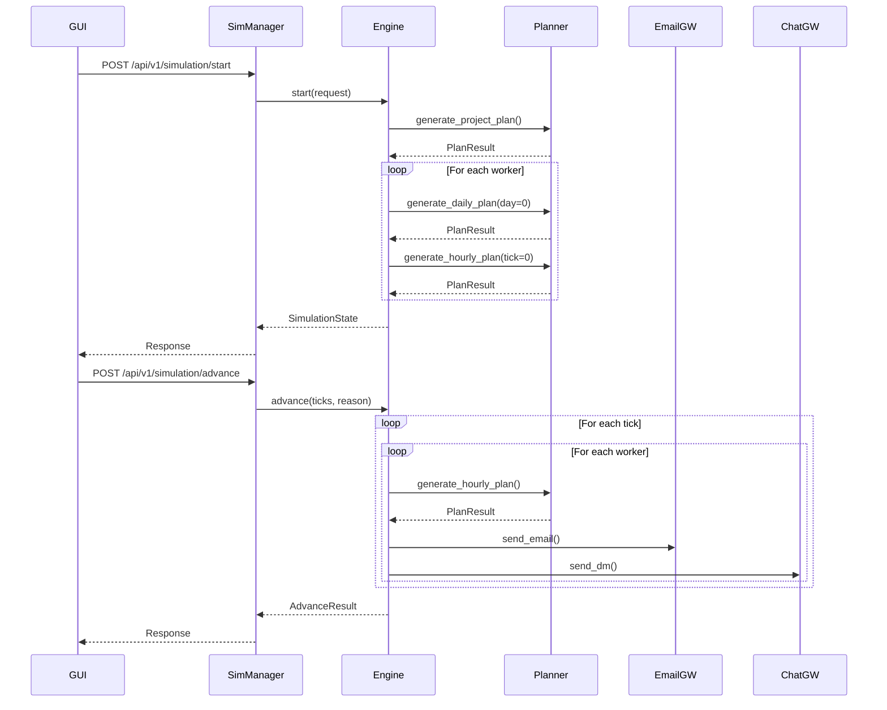

# VDOS Architecture

## System Overview

VDOS is a three-tier architecture with FastAPI services, a PySide6 GUI, and a shared SQLite database.

```
┌───────────────────────────────────────────────────────────────┐
│                    PySide6 GUI Dashboard                       │
│                  (src/virtualoffice/app.py)                    │
│                                                                 │
│  ┌──────────────┐  ┌──────────────┐  ┌───────────────────┐   │
│  │   Server     │  │  Simulation  │  │     Persona       │   │
│  │  Management  │  │   Controls   │  │   Management      │   │
│  │              │  │              │  │                   │   │
│  │ Start/Stop   │  │ Start/Stop   │  │ Create/Edit       │   │
│  │ Services     │  │ Advance      │  │ View Reports      │   │
│  └──────────────┘  └──────────────┘  └───────────────────┘   │
└───────────────────────────────────────────────────────────────┘
                           │
                           │ HTTP/REST
         ┌─────────────────┼─────────────────┐
         │                 │                 │
         ▼                 ▼                 ▼
    ┌────────┐        ┌────────┐       ┌────────────┐
    │ Email  │        │  Chat  │       │Simulation  │
    │ Server │        │ Server │       │  Manager   │
    │:8000   │        │ :8001  │       │   :8015    │
    └────┬───┘        └────┬───┘       └─────┬──────┘
         │                 │                  │
         │                 │           ┌──────▼──────────┐
         │                 │           │ SimulationEngine│
         │                 │           │                 │
         │                 │           │  Planner        │
         │                 │           │  Workers        │
         │                 │           │  Events         │
         │                 │           │  Gateways       │
         │                 │           └─────────────────┘
         │                 │                  │
         └─────────────────┴──────────────────┘
                           │
                      ┌────▼─────┐
                      │  SQLite  │
                      │ vdos.db  │
                      └──────────┘
```

## Component Architecture

### 1. Email Server (Port 8000)
**Location**: `src/virtualoffice/servers/email/`

**Responsibilities**:
- Email storage and retrieval
- Mailbox management
- Draft management
- Thread tracking

**Key Files**:
- `app.py` - FastAPI application with endpoints
- `models.py` - Pydantic models (EmailSend, EmailMessage, Mailbox, DraftCreate)

**Database Tables**:
- `mailboxes` - Email addresses and display names
- `emails` - Email messages
- `email_recipients` - To/CC/BCC recipients
- `drafts` - Draft emails

### 2. Chat Server (Port 8001)
**Location**: `src/virtualoffice/servers/chat/`

**Responsibilities**:
- Chat room management
- Direct message (DM) handling
- User management
- Message storage and retrieval

**Key Files**:
- `app.py` - FastAPI application
- `models.py` - Pydantic models (RoomCreate, MessagePost, DMPost)

**Database Tables**:
- `chat_users` - Chat handles and display names
- `chat_rooms` - Chat rooms and DM channels
- `chat_members` - Room membership
- `chat_messages` - Messages within rooms

### 3. Simulation Manager (Port 8015)
**Location**: `src/virtualoffice/sim_manager/`

**Responsibilities**:
- Simulation orchestration
- Tick advancement
- Worker planning lifecycle
- Event injection
- Report generation
- Multi-project support

**Key Files**:
- `app.py` - FastAPI application (515 lines)
- `engine.py` - Core simulation engine (2360 lines)
- `planner.py` - GPT and Stub planners (546 lines)
- `gateways.py` - HTTP clients for email/chat (110 lines)
- `schemas.py` - Pydantic models (171 lines)

**Database Tables**:
- `people` - Virtual worker personas
- `schedule_blocks` - Worker schedules
- `simulation_state` - Current tick and running status
- `project_plans` - Project roadmaps
- `project_assignments` - Person-to-project mappings
- `worker_plans` - Daily and hourly plans
- `daily_reports` - End-of-day summaries
- `simulation_reports` - End-of-simulation summaries
- `events` - Injected simulation events
- `tick_log` - Tick advancement history
- `worker_runtime_messages` - Inbox queue
- `worker_exchange_log` - Communication history
- `worker_status_overrides` - Sick leave, etc.

### 4. Virtual Workers
**Location**: `src/virtualoffice/virtualWorkers/`

**Responsibilities**:
- Persona markdown generation
- Worker identity and behavior definition
- Schedule rendering

**Key Classes**:
- `WorkerPersona` - Dataclass for persona attributes
- `VirtualWorker` - Worker wrapper with prompt generation
- `ScheduleBlock` - Time block for daily schedule

### 5. PySide6 GUI
**Location**: `src/virtualoffice/app.py` (1197 lines)

**Responsibilities**:
- Start/stop FastAPI services individually
- Start/stop simulations with project configuration
- Manual tick advancement and automatic ticking
- Create and manage personas (with optional GPT-4o assistance)
- View real-time reports, logs, and token usage
- Monitor simulation state and worker status
- Participant selection for simulations

**Key Classes**:
- `virtualOffice` - Main window (QMainWindow) with server lifecycle management
- `SimulationDashboard` - Main dashboard widget with comprehensive controls
- `PersonDialog` - Persona creation/editing dialog with AI generation
- `RequestWorker` - Background HTTP request worker (QRunnable)
- `ServerHandle` - Server lifecycle wrapper with threading
- `WorkerSignals` - Qt signals for async communication

**Key Features**:
- Real-time log viewing with auto-refresh
- Token usage tracking and display
- Multi-tab report viewing (daily, simulation, hourly plans, events)
- Participant inclusion/exclusion controls
- Department head selection
- Random seed configuration for reproducible simulations

## Data Flow

### Simulation Lifecycle



### Message Routing

1. **Outbound**: Engine → Gateway → Server → Database
2. **Inbound**: Database → Server → Gateway → Engine → Worker Inbox
3. **Processing**: Worker drains inbox → Planner generates response → Engine sends replies

### Planning Hierarchy

```
Project Plan (once per simulation)
    ↓
Daily Plan (once per worker per day)
    ↓
Hourly Plan (each tick when messages arrive or reason changes)
    ↓
Daily Report (end of each day)
    ↓
Simulation Report (end of simulation)
```

## Database Schema

### Core Tables

#### people
Stores virtual worker personas.

| Column | Type | Description |
|--------|------|-------------|
| id | INTEGER PK | Unique identifier |
| name | TEXT | Worker name |
| role | TEXT | Job title |
| timezone | TEXT | IANA timezone |
| work_hours | TEXT | e.g., "09:00-18:00" |
| break_frequency | TEXT | e.g., "50/10 cadence" |
| communication_style | TEXT | Communication preferences |
| email_address | TEXT | Email address |
| chat_handle | TEXT | Chat username |
| is_department_head | INTEGER | 0 or 1 |
| skills | TEXT | JSON array |
| personality | TEXT | JSON array |
| objectives | TEXT | JSON array |
| metrics | TEXT | JSON array |
| persona_markdown | TEXT | Full persona spec |
| planning_guidelines | TEXT | JSON array |
| event_playbook | TEXT | JSON object |
| statuses | TEXT | JSON array |
| created_at | TEXT | Timestamp |

#### simulation_state
Single-row table tracking simulation state.

| Column | Type | Description |
|--------|------|-------------|
| id | INTEGER PK | Always 1 |
| current_tick | INTEGER | Current simulation tick |
| is_running | INTEGER | 0 or 1 |
| auto_tick | INTEGER | 0 or 1 |

#### project_plans
Multi-project support.

| Column | Type | Description |
|--------|------|-------------|
| id | INTEGER PK | Unique identifier |
| project_name | TEXT | Project name |
| project_summary | TEXT | Project summary |
| plan | TEXT | Generated project plan |
| generated_by | INTEGER | FK to people.id |
| duration_weeks | INTEGER | Project duration |
| start_week | INTEGER | Week project starts (1-indexed) |
| model_used | TEXT | LLM model name |
| tokens_used | INTEGER | Token count |
| created_at | TEXT | Timestamp |

#### worker_plans
Daily and hourly plans.

| Column | Type | Description |
|--------|------|-------------|
| id | INTEGER PK | Unique identifier |
| person_id | INTEGER | FK to people.id |
| tick | INTEGER | Tick or day index |
| plan_type | TEXT | 'daily' or 'hourly' |
| content | TEXT | Plan text |
| model_used | TEXT | LLM model name |
| tokens_used | INTEGER | Token count |
| context | TEXT | Additional context |
| created_at | TEXT | Timestamp |

### Communication Tables

#### emails (Email Server)
| Column | Type | Description |
|--------|------|-------------|
| id | INTEGER PK | Unique identifier |
| sender | TEXT | From address |
| subject | TEXT | Subject line |
| body | TEXT | Email body |
| thread_id | TEXT | Thread identifier |
| sent_at | TEXT | Timestamp |

#### chat_messages (Chat Server)
| Column | Type | Description |
|--------|------|-------------|
| id | INTEGER PK | Unique identifier |
| room_id | INTEGER | FK to chat_rooms.id |
| sender | TEXT | Chat handle |
| body | TEXT | Message content |
| sent_at | TEXT | Timestamp |

## Communication Patterns

### Deduplication
Engine tracks sent messages to prevent duplicates:
- `_sent_dedup`: Set of (tick, channel, sender, recipients, subject, body)
- `_last_contact`: Dict of (channel, sender, recipient) → last tick
- `_contact_cooldown_ticks`: Minimum ticks between contacts (default 10)

### Scheduled Communications
Hourly plans can include scheduled communications:

**Format**:
```
Email at 10:30 to dev cc pm, designer: Subject | Body text
Chat at 14:00 with designer: Message text
```

**Processing**:
1. Planner generates hourly plan with scheduled comms
2. Engine parses scheduled comm lines
3. Engine dispatches at specified ticks
4. Fallback sends occur if no scheduled comms exist

### Acknowledgements
When a worker receives a message:
1. Message added to inbox
2. On next planning cycle, inbox drained
3. Worker sends chat acknowledgement to sender
4. Acknowledgement queued in sender's inbox

## Configuration

### Environment Variables

| Variable | Default | Description |
|----------|---------|-------------|
| `VDOS_EMAIL_HOST` | 127.0.0.1 | Email server host |
| `VDOS_EMAIL_PORT` | 8000 | Email server port |
| `VDOS_CHAT_HOST` | 127.0.0.1 | Chat server host |
| `VDOS_CHAT_PORT` | 8001 | Chat server port |
| `VDOS_SIM_HOST` | 127.0.0.1 | Simulation server host |
| `VDOS_SIM_PORT` | 8015 | Simulation server port |
| `VDOS_SIM_BASE_URL` | http://127.0.0.1:8015 | Full simulation base URL |
| `VDOS_DB_PATH` | src/virtualoffice/vdos.db | Database path |
| `VDOS_DB_URL` | sqlite:///./vdos.db | Database connection URL |
| `VDOS_TICK_MS` | 50 | Wall-clock milliseconds per tick |
| `VDOS_BUSINESS_DAYS` | 5 | Default simulation duration |
| `VDOS_WORKDAY_START` | 09:00 | Business hours start |
| `VDOS_WORKDAY_END` | 18:00 | Business hours end |
| `VDOS_DEFAULT_BREAK_PATTERN` | 25/5,90/lunch/60 | Work/break rhythm |
| `VDOS_LOCALE_TZ` | Asia/Seoul | Timezone for simulation |
| `VDOS_SIM_EMAIL` | simulator@vdos.local | Simulation manager email |
| `VDOS_SIM_HANDLE` | sim-manager | Simulation manager chat handle |
| `VDOS_GUI_AUTOKILL_SECONDS` | - | Auto-shutdown for testing (optional) |
| `VDOS_PLANNER_STRICT` | 0 | Disable stub fallback |
| `VDOS_LOCALE` | en | Locale (en or ko) |
| `VDOS_CONTACT_COOLDOWN_TICKS` | 10 | Min ticks between contacts |
| `VDOS_MAX_HOURLY_PLANS_PER_MINUTE` | 10 | Planning rate limit |
| `OPENAI_API_KEY` | - | OpenAI API key (optional) |

### Model Configuration

| Variable | Default | Description |
|----------|---------|-------------|
| `VDOS_PLANNER_PROJECT_MODEL` | gpt-4.1-nano | Project plan model |
| `VDOS_PLANNER_DAILY_MODEL` | (same as project) | Daily plan model |
| `VDOS_PLANNER_HOURLY_MODEL` | (same as daily) | Hourly plan model |
| `VDOS_PLANNER_DAILY_REPORT_MODEL` | (same as daily) | Daily report model |
| `VDOS_PLANNER_SIM_REPORT_MODEL` | (same as project) | Sim report model |

## Threading Model

### GUI Application
- Main thread: Qt event loop
- Background threads: HTTP requests via `RequestWorker` (QRunnable)
- Thread pool: `QThreadPool.globalInstance()`

### Simulation Engine
- Main thread: FastAPI event loop
- Auto-tick thread: Optional background thread for automatic advancement
- Lock: `_advance_lock` prevents concurrent tick advancement

## Error Handling

### Planner Fallback
When `GPTPlanner` fails:
1. Log error and duration
2. If `VDOS_PLANNER_STRICT=1`, raise RuntimeError
3. Otherwise, fall back to `StubPlanner`
4. Record fallback in `_planner_metrics`

### Service Startup
- GUI attempts server startup with 5-second timeout
- If startup fails, error displayed in dashboard
- Services can be restarted independently

### API Errors
- 400 Bad Request: Invalid input
- 404 Not Found: Resource missing
- 422 Unprocessable Entity: Validation error
- 500 Internal Server Error: Server failure

## Performance Considerations

### Rate Limiting
- Hourly planning: Max 10 plans per person per minute
- Contact cooldown: 10 ticks between same sender/recipient pairs

### Caching
- Project plan cached in `_project_plan_cache`
- Worker runtimes cached in `_worker_runtime`
- Status overrides cached in `_status_overrides`

### Database
- Single SQLite file for all services
- Indices on frequently queried columns
- Foreign key constraints for referential integrity

## Extensibility

### Adding New Planning Methods
1. Add method to `Planner` protocol in `planner.py`
2. Implement in both `GPTPlanner` and `StubPlanner`
3. Call via `engine._call_planner()`

### Adding New Events
1. Create event payload in `EventCreate` schema
2. Inject via `engine.inject_event()`
3. Process in `engine._maybe_generate_events()`

### Adding New Reports
1. Add database table for report type
2. Add Pydantic schema in `schemas.py`
3. Add API endpoint in `app.py`
4. Implement generation in `engine.py`
